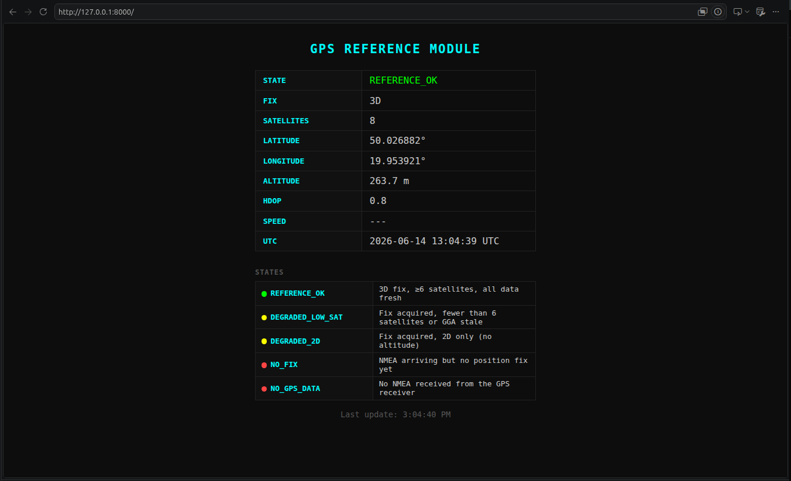
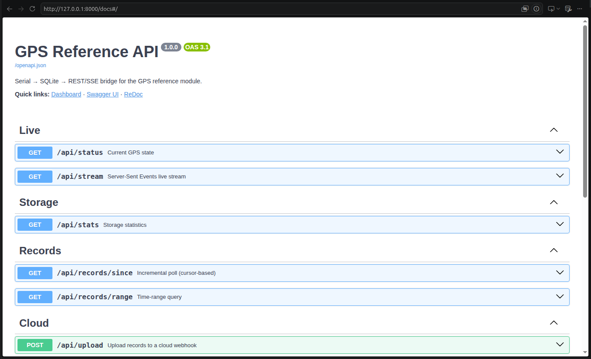
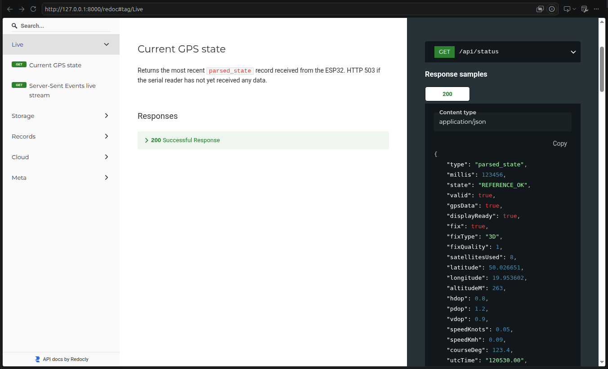
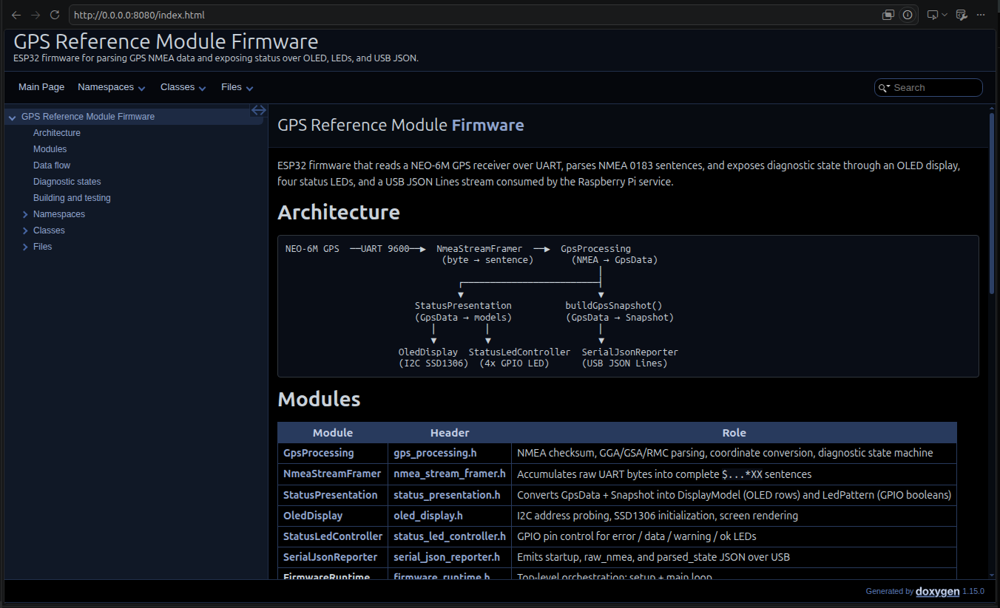
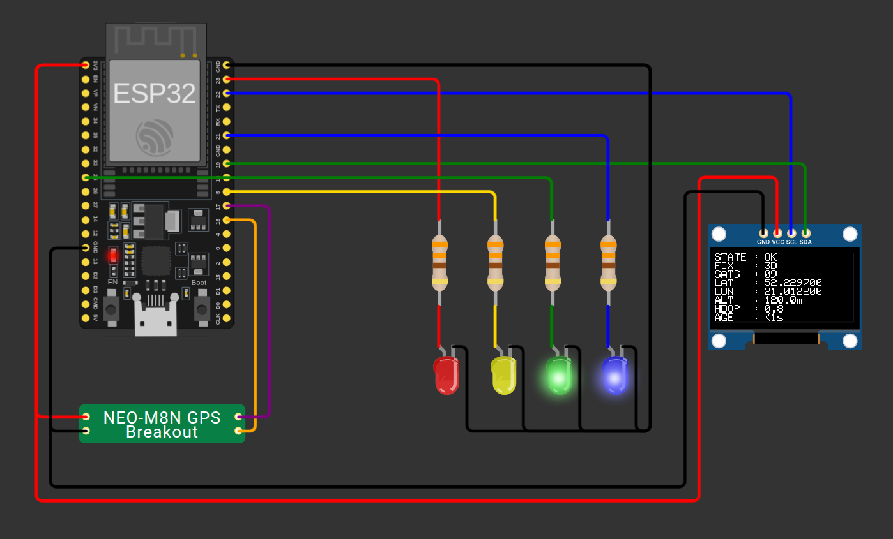
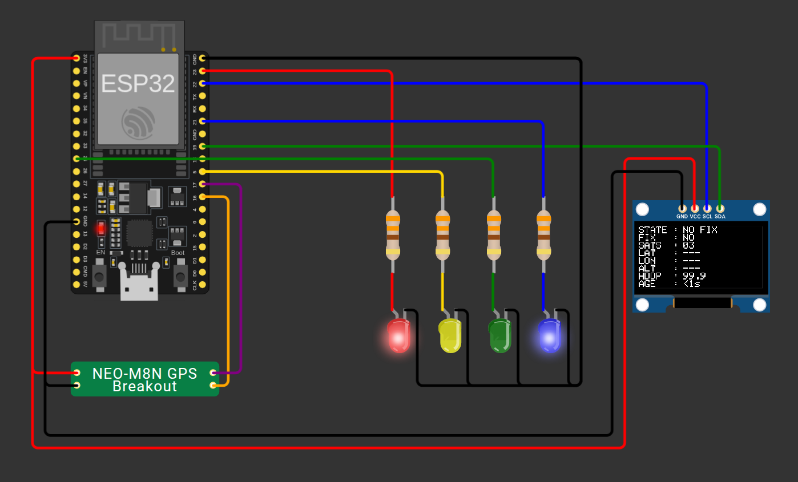
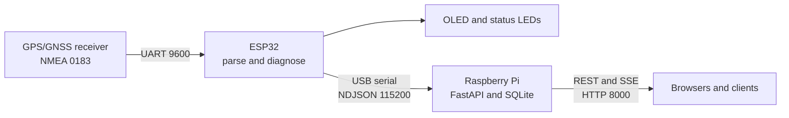

<h1 align="center">GPS Reference Module</h1>

<p align="center">
  <strong>ESP32 GPS acquisition, Raspberry Pi storage, and network API</strong>
</p>

<p align="center">
  <a href="https://github.com/jakubpawlina/GPS-reference-module/actions/workflows/ci.yml"></a>
  <a href="https://www.espressif.com/en/products/socs/esp32"></a>
  <a href="https://www.arduino.cc/"></a>
  <a href="https://www.python.org/"></a>
  <a href="https://fastapi.tiangolo.com/"></a>
  <a href="https://www.sqlite.org/"></a>
  <a href="https://wokwi.com/"></a>
</p>

A self-contained GPS reference station for local test and measurement networks.
An ESP32 validates and parses NMEA data, presents the current state on an OLED
and LEDs, and streams structured JSON over USB. A Raspberry Pi stores the data
in SQLite and exposes a browser dashboard, REST API, and SSE stream.

## Highlights

- Parses NMEA GGA, GSA, and RMC sentences at 1 Hz
- Reports fix quality, coordinates, altitude, DOP, satellites, and data age
- Uses an OLED and four LEDs for immediate diagnostic feedback
- Streams startup, raw NMEA, and parsed-state messages as NDJSON
- Stores historical records in SQLite with automatic size management
- Provides REST, SSE, Swagger UI, ReDoc, and a live browser dashboard
- Includes host-side firmware tests and a complete Wokwi simulation
- Installs as a supervised `systemd` service on Raspberry Pi

## Navigation

| Getting Started | Technical Reference | Project |
|---|---|---|
| [Prerequisites](#prerequisites) | [Architecture](#architecture) | [Development](#development) |
| [Quick Start](#quick-start) | [Diagnostic States](#diagnostic-states) | [Contributing](#contributing) |
| [Run the Simulation](#2-run-the-simulation) | [Data and API](#data-and-api) | [Repository Layout](#repository-layout) |
| [Deploy to Raspberry Pi](#4-deploy-the-raspberry-pi-service) | [Simulation Reference](#simulation-reference) | [Documentation](#documentation) |
|  | [Service Configuration](#service-configuration) |  |

## Preview

### Browser dashboard

The Raspberry Pi service exposes a live dashboard at `http://<rpi-ip>:8000/`
that updates in real time via Server-Sent Events.

<p align="center">
  
</p>

### Swagger UI

Auto-generated interactive API explorer at `/docs` with try-it-out support.

<p align="center">
  
</p>

### ReDoc

Three-panel API reference at `/redoc` with response schemas and examples.

<p align="center">
  
</p>

### Firmware API documentation

Generated Doxygen documentation with architecture overview, module reference,
and browsable source code (`mise run docs:serve`).

<p align="center">
  
</p>

### Wokwi simulation

The Wokwi project runs the production ESP32 firmware with a simulated NEO-M8N
receiver, SSD1306 OLED, and status LEDs.

#### Reference OK

<p align="center">
  
</p>

#### GPS data, no fix

<p align="center">
  
</p>

---

## Getting Started

### Prerequisites

#### Manual requirements

| Environment | Requirement | When it is needed |
|---|---|---|
| Developer machine | Git, `mise`, Bash, standard Unix tools | All development workflows |
| Service tests | Python virtual environments and package installer | `mise run service:bootstrap` |
| Simulation | Docker Engine | Building the custom GPS WebAssembly component |
| Simulation | VS Code and Wokwi extension | Launching the local simulator |
| Firmware tests | C++ compiler (`g++`) | `mise run test:unit` |
| API documentation | Doxygen | `mise run docs:generate` or `mise run docs:serve` |
| Raspberry Pi | Python 3.9+, `sudo`, `systemd`, `refmod` user | Service deployment |
| Initial setup | Internet access | Toolchains, packages, libraries, and container images |

On Debian or Ubuntu, optional test and documentation tools can be installed
with:

```bash
sudo apt update
sudo apt install g++ doxygen
```

#### Installed automatically

`mise install` and `mise run firmware:bootstrap` install:

- Python 3.13 for development tasks
- Arduino CLI 1.4.1
- ESP32 Arduino core `esp32:esp32`
- Adafruit SSD1306
- Adafruit GFX Library

`mise run service:bootstrap` creates the ignored `.venv/` environment and
installs the Raspberry Pi service dependencies used by `test:service`.

`mise run simulation:build` downloads the official
`wokwi/builder-clang-wasm` image when required.

The Raspberry Pi installer adds `python3-pip`, `python3-venv`, `python3-dev`,
`curl`, and all packages from `service/requirements.txt`.

#### Physical hardware

- ESP32 development board
- NMEA 0183 GPS/GNSS receiver configured for 9600 baud
- 128x64 SSD1306 I2C OLED
- Red, blue, yellow, and green LEDs
- Four 220-330 ohm current-limiting resistors
- Raspberry Pi running Raspberry Pi OS or another Debian-based distribution
- USB cables for flashing and ESP32-to-Raspberry Pi communication

See [docs/hardware.md](docs/hardware.md) for the complete bill of materials,
wiring, power requirements, and GPIO warnings.

### Quick Start

#### 1. Prepare the development environment

Install [Git](https://git-scm.com/) and
[`mise`](https://mise.jdx.dev/getting-started.html), then clone and bootstrap
the project:

```bash
git clone https://github.com/jakubpawlina/GPS-reference-module.git
cd GPS-reference-module
mise install
mise run firmware:bootstrap
mise run service:bootstrap
```

#### 2. Run the simulation

Install Docker, Visual Studio Code, and the
[Wokwi for VS Code extension](https://marketplace.visualstudio.com/items?itemName=Wokwi.wokwi-vscode),
then build the complete simulator:

```bash
mise run simulation:build
```

Open `simulation/wokwi/` as a VS Code workspace and run
**Wokwi: Start Simulator** from the command palette. Use `Ctrl+Shift+B` to
rebuild after firmware changes. The generated
[`TESTING.md`](simulation/assets/TESTING.md) provides a physical-like acceptance
test for the OLED, four status LEDs, and serial JSON output.

> [!NOTE]
> Docker is required only to compile the custom Wokwi GPS chip. It is not
> required for firmware tests, ESP32 builds, or Raspberry Pi deployment.

#### 3. Build and flash the ESP32

Connect the board and adjust the serial port if necessary:

```bash
mise run firmware:compile
arduino-cli compile --upload \
  --fqbn esp32:esp32:esp32 \
  --port /dev/ttyUSB0 \
  firmware/gps_reference_module
```

#### 4. Deploy the Raspberry Pi service

Copy the runtime files to the Raspberry Pi:

```bash
ssh pi@<rpi-ip> 'mkdir -p ~/gps-reference'
scp -r service tools pi@<rpi-ip>:~/gps-reference/
ssh pi@<rpi-ip>
cd ~/gps-reference
id refmod >/dev/null 2>&1 || sudo useradd --system --create-home --groups dialout refmod
GPS_APP_USER=refmod ./tools/deploy-rpi-service.sh
```

The installer adds system packages, creates a virtual environment, installs
Python dependencies, configures serial access, and installs the `systemd`
service. A logout or reboot may be required when the user is first added to the
`dialout` group.

> [!IMPORTANT]
> The HTTP API has no authentication by default. Set `GPS_API_KEY` to require a
> Bearer token on write endpoints (`/api/upload`), or deploy behind an
> authenticated reverse proxy. See [Security hardening](docs/deploy.md#security-hardening).

#### 5. Verify the system

Connect the ESP32 to the Raspberry Pi over USB and open:

| URL | Purpose |
|---|---|
| `http://<rpi-ip>:8000/` | Live dashboard |
| `http://<rpi-ip>:8000/docs` | Interactive Swagger API |
| `http://<rpi-ip>:8000/redoc` | ReDoc API reference |
| `http://<rpi-ip>:8000/api/status` | Current GPS state |
| `http://<rpi-ip>:8000/api/stats` | Storage statistics |

---

## Technical Reference

### Architecture



### Diagnostic States

| State | LEDs | Meaning |
|---|---|---|
| `REFERENCE_OK` | Blue + Green | Fresh 3D fix with at least six satellites |
| `DEGRADED_LOW_SAT` | Blue + Yellow | Fix active, but satellite count is low or GGA is stale |
| `DEGRADED_2D` | Blue + Yellow | 2D fix without usable altitude |
| `NO_FIX` | Red + Blue | NMEA data is arriving without a position fix |
| `NO_GPS_DATA` | Red | No recent NMEA data |

### Data and API

The ESP32 emits newline-delimited JSON at 115200 baud:

- `startup`: firmware and display initialization details
- `raw_nmea`: original NMEA sentence and validation result
- `parsed_state`: current parsed position and diagnostic state

The Raspberry Pi keeps the latest state in memory, stores position records in
SQLite, and serves live and historical data over HTTP.

| Method | Endpoint | Purpose |
|---|---|---|
| `GET` | `/api/status` | Latest state from the ESP32 |
| `GET` | `/api/stream` | Live Server-Sent Events stream |
| `GET` | `/api/records/since` | Cursor-based incremental records |
| `GET` | `/api/records/range` | Historical records by time range |
| `GET` | `/api/stats` | Database size and record statistics |
| `POST` | `/api/upload` | Upload records to a configured webhook |

### Simulation Reference

The custom GPS component exposes a **Scenario** control:

| Value | Simulated state |
|---:|---|
| `0` | Automatic demonstration cycling through all states |
| `1` | No GPS data |
| `2` | GPS data received, no fix |
| `3` | 2D fix warning |
| `4` | 3D fix with too few satellites |
| `5` | Reference OK |

The build creates an ignored `simulation/wokwi/` workspace containing the
firmware BIN and ELF files, custom GPS WebAssembly component, Wokwi
configuration, diagram, and firmware sources.

### Service Configuration

The Raspberry Pi service is configured through environment variables in
`/etc/systemd/system/gps-reference.service.d/local.conf`:

```ini
[Service]
Environment=GPS_SERIAL_PORT=/dev/ttyUSB0
Environment=GPS_BAUD_RATE=115200
Environment=GPS_DB_PATH=/var/lib/gps-reference/data.db
Environment=GPS_MAX_DB_BYTES=4294967296
Environment=GPS_MAX_SSE_CONNECTIONS=32
Environment=GPS_HTTP_PORT=8000
# Environment=GPS_API_KEY=your-secret-token
# Environment=GPS_CLOUD_WEBHOOK=https://example.com/ingest
```

| Variable | Default | Purpose |
|---|---|---|
| `GPS_SERIAL_PORT` | `/dev/ttyUSB0` | ESP32 serial device |
| `GPS_BAUD_RATE` | `115200` | ESP32 USB serial baud rate |
| `GPS_DB_PATH` | `/var/lib/gps-reference/data.db` | SQLite database |
| `GPS_MAX_DB_BYTES` | `4294967296` | Maximum database size, default 4 GiB |
| `GPS_MAX_SSE_CONNECTIONS` | `32` | Maximum concurrent dashboard event streams |
| `GPS_HTTP_PORT` | `8000` | HTTP server port |
| `GPS_API_KEY` | Empty | Optional Bearer token for write endpoints (`/api/upload`) |
| `GPS_CLOUD_WEBHOOK` | Empty | Optional upload destination |

After changing the configuration:

```bash
sudo systemctl daemon-reload
sudo systemctl restart gps-reference
```

---

## Project Development

### Development

Run `mise run help` to see this flow at any time.

#### Recommended workflow

```
1. SETUP (once)
   mise install
   mise run firmware:bootstrap
   mise run service:bootstrap

2. DEVELOP
   mise run service:dev          ← live service with fake GPS, no hardware needed

3. TEST  (pick the layer that matches your change)
   mise run test:unit            ← firmware logic (fastest, no peripherals)
   mise run test:integration     ← firmware runtime with simulated peripherals
   mise run test:simulation      ← Wokwi project assets and GPS chip
   mise run test:service         ← service storage, API, and lifecycle

4. FORMAT + LINT
   mise run format               ← auto-format Python, C++, and shell
   mise run lint                 ← static analysis

5. COMMIT GATE
   mise run test:all             ← every host-side test layer (no Docker)

6. PR GATE
   mise run verify               ← all tests + ESP32 and Wokwi builds (requires Docker)
```

#### Task reference

| Command | Purpose |
|---|---|
| `mise run help` | Show the recommended development workflow |
| `mise install` | Install Python, Arduino CLI, ruff, shfmt |
| `mise run firmware:bootstrap` | Install the ESP32 core and Arduino libraries |
| `mise run service:bootstrap` | Create the Python venv and install service dependencies |
| `mise run service:dev` | Run the service locally with fake GPS data |
| `mise run test:unit` | Test pure firmware logic |
| `mise run test:integration` | Test firmware runtime with simulated peripherals |
| `mise run test:simulation` | Test Wokwi project assets, generation, and GPS chip logic |
| `mise run test:service` | Test service storage, API, and lifecycle behavior |
| `mise run test:all` | Run every host-side test layer (no Docker required) |
| `mise run format` | Auto-format Python, C++, and shell |
| `mise run format:check` | Verify formatting without changes (CI gate) |
| `mise run lint` | Python and shell static analysis |
| `mise run verify` | All tests plus ESP32 and Wokwi builds (requires Docker) |
| `mise run firmware:compile` | Compile firmware for the ESP32 |
| `mise run simulation:generate` | Generate Wokwi simulator sources without compiling |
| `mise run simulation:build` | Build the complete VS Code simulation |
| `mise run docs:generate` | Generate Doxygen firmware API documentation |
| `mise run docs:serve` | Generate and serve firmware documentation locally |
| `mise run deploy:install` | Install or upgrade the Raspberry Pi service |
| `mise run deploy:uninstall` | Remove the Raspberry Pi service (data is preserved) |

### Contributing

Bug reports, documentation fixes, hardware validation, and focused feature
contributions are welcome.

1. Search the [existing issues](https://github.com/jakubpawlina/GPS-reference-module/issues)
   before opening a new report.
2. Fork the repository and create a focused branch from the current default
   branch.
3. Keep changes scoped and follow the existing firmware, Python, and shell
   conventions.
4. Add or update tests and documentation when behavior changes.
5. Run the relevant checks before opening a pull request.

Before opening a pull request, run `mise run verify` (all tests and builds) and `mise run docs:generate` if any public firmware headers changed. See [tests/README.md](tests/README.md) for test-layer boundaries and compatibility notes.

Pull requests should explain the problem, implementation, hardware or
simulation assumptions, and verification commands. Include screenshots or
serial/API samples for visible behavior changes.

Use the repository templates to
[report a bug](https://github.com/jakubpawlina/GPS-reference-module/issues/new?template=bug_report.yml)
or
[request a feature](https://github.com/jakubpawlina/GPS-reference-module/issues/new?template=feature_request.yml).
Do not publish credentials, private network details, or unredacted production
data.

> [!WARNING]
> For a potential security vulnerability, do not open a public issue. Follow
> the reporting process in [SECURITY.md](SECURITY.md).

### Repository Layout

Only the main entrypoints are shown; each directory also contains supporting
modules and configuration files.

```text
gps-reference-module/
├── firmware/gps_reference_module/
│   ├── gps_reference_module.ino   Arduino entrypoint
│   ├── src/                       Firmware implementation
│   └── ...
├── service/
│   ├── main.py                    Raspberry Pi service entrypoint
│   ├── requirements.txt           Python dependencies
│   └── ...
├── simulation/assets/             Wokwi diagram, configuration, and GPS chip
├── tests/
│   ├── firmware/                  Pure firmware unit tests
│   ├── integration/               Runtime and simulated-peripheral tests
│   ├── simulation/                Wokwi project and custom-chip tests
│   └── service/                   Raspberry Pi service tests
├── tools/                         Build, simulation, and deployment scripts
├── docs/                          Technical documentation
├── mise.toml                      Tool versions and task definitions
└── ...
```

### Documentation

| Document | Contents |
|---|---|
| [System design](docs/design.md) | Architecture, specifications, and engineering decisions |
| [Hardware](docs/hardware.md) | Components, wiring, GPIO assignments, and electrical notes |
| [Firmware](docs/firmware.md) | Build process, configuration, output protocol, and internals |
| [Simulation](docs/simulation.md) | Wokwi project, scenarios, wiring, and regeneration |
| [API](docs/api.md) | Complete REST and SSE endpoint reference |
| [Deployment](docs/deploy.md) | Raspberry Pi installation, configuration, and operations |
