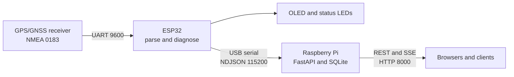

<h1 align="center">GPS Reference Module</h1>

<p align="center">
  <strong>ESP32 GPS acquisition, Raspberry Pi storage, and network API</strong>
</p>

<p align="center">
  <a href="https://www.espressif.com/en/products/socs/esp32"></a>
  <a href="https://www.arduino.cc/"></a>
  <a href="https://www.python.org/"></a>
  <a href="https://fastapi.tiangolo.com/"></a>
  <a href="https://www.sqlite.org/"></a>
  <a href="https://wokwi.com/"></a>
</p>

A self-contained GPS reference station for local test and measurement networks.
An ESP32 validates and parses NMEA data, presents the current state on an OLED
and LEDs, and streams structured JSON over USB. A Raspberry Pi stores the data
in SQLite and exposes a browser dashboard, REST API, and SSE stream.

## Highlights

- Parses NMEA GGA, GSA, and RMC sentences at 1 Hz
- Reports fix quality, coordinates, altitude, DOP, satellites, and data age
- Uses an OLED and four LEDs for immediate diagnostic feedback
- Streams startup, raw NMEA, and parsed-state messages as NDJSON
- Stores historical records in SQLite with automatic size management
- Provides REST, SSE, Swagger UI, ReDoc, and a live browser dashboard
- Includes host-side firmware tests and a complete Wokwi simulation
- Installs as a supervised `systemd` service on Raspberry Pi

## Contents

- [Preview](#preview)
- [Quick Start](#quick-start)
- [Requirements](#requirements)
- [System Behavior](#system-behavior)
- [Simulation Scenarios](#simulation-scenarios)
- [Development](#development)
- [Configuration](#configuration)
- [Documentation](#documentation)

## Architecture



## Preview

The Wokwi project runs the production ESP32 firmware with a simulated NEO-M8N
receiver, SSD1306 OLED, and status LEDs.

### Reference OK

<p align="center">
  
</p>

### GPS data, no fix

<p align="center">
  
</p>

## Quick Start

### 1. Prepare the development environment

Install [Git](https://git-scm.com/) and
[`mise`](https://mise.jdx.dev/getting-started.html), then clone and bootstrap
the project:

```bash
git clone https://github.com/jakubpawlina/GPS-reference-module.git
cd GPS-reference-module
mise install
mise run firmware:bootstrap
```

This installs the pinned Python and Arduino CLI versions, the ESP32 Arduino
core, and the required Adafruit display libraries.

### 2. Run the simulation

Install Docker, Visual Studio Code, and the
[Wokwi for VS Code extension](https://marketplace.visualstudio.com/items?itemName=Wokwi.wokwi-vscode).
Then build the complete simulator:

```bash
mise run simulation:build
```

Open `simulation/wokwi/` as a VS Code workspace and run
**Wokwi: Start Simulator** from the command palette. Use `Ctrl+Shift+B` to
rebuild after firmware changes.

> [!NOTE]
> Docker is required only to compile the custom Wokwi GPS chip. It is not
> required for firmware tests, ESP32 builds, or Raspberry Pi deployment.

### 3. Build and flash the ESP32

Connect the board and adjust the serial port if necessary:

```bash
mise run firmware:compile
arduino-cli compile --upload \
  --fqbn esp32:esp32:esp32 \
  --port /dev/ttyUSB0 \
  firmware/gps_reference_module
```

### 4. Deploy the Raspberry Pi service

Copy the runtime files to the Raspberry Pi:

```bash
ssh pi@<rpi-ip> 'mkdir -p ~/gps-reference'
scp -r service tools pi@<rpi-ip>:~/gps-reference/
ssh pi@<rpi-ip>
cd ~/gps-reference
id refmod >/dev/null 2>&1 || sudo useradd --system --create-home --groups dialout refmod
GPS_APP_USER=refmod ./tools/deploy-rpi-service.sh
```

The installer adds system packages, creates a virtual environment, installs
Python dependencies, configures serial access, and installs the `systemd`
service. A logout or reboot may be required when the user is first added to the
`dialout` group.

> [!IMPORTANT]
> The HTTP API has no authentication and permits cross-origin requests. Deploy
> it only on a trusted network or place it behind an authenticated reverse proxy.

### 5. Verify the system

Connect the ESP32 to the Raspberry Pi over USB and open:

| URL | Purpose |
|---|---|
| `http://<rpi-ip>:8000/` | Live dashboard |
| `http://<rpi-ip>:8000/docs` | Interactive Swagger API |
| `http://<rpi-ip>:8000/redoc` | ReDoc API reference |
| `http://<rpi-ip>:8000/api/status` | Current GPS state |
| `http://<rpi-ip>:8000/api/stats` | Storage statistics |

## Requirements

### Manual prerequisites

| Environment | Requirement | When it is needed |
|---|---|---|
| Developer machine | Git, `mise`, Bash, standard Unix tools | All development workflows |
| Simulation | Docker Engine | Building the custom GPS WebAssembly component |
| Simulation | VS Code and Wokwi extension | Launching the local simulator |
| Firmware tests | C++ compiler (`g++`) | `mise run firmware:test` |
| API documentation | Doxygen | `mise run firmware:docs` or `mise run docs:serve` |
| Raspberry Pi | Python 3.9+, `sudo`, `systemd`, `refmod` user | Service deployment |
| Initial setup | Internet access | Toolchains, packages, libraries, and container images |

On Debian or Ubuntu, optional test and documentation tools can be installed
with:

```bash
sudo apt update
sudo apt install g++ doxygen
```

### Installed automatically

`mise install` and `mise run firmware:bootstrap` install:

- Python 3.13 for development tasks
- Arduino CLI 1.4.1
- ESP32 Arduino core `esp32:esp32`
- Adafruit SSD1306
- Adafruit GFX Library

`mise run simulation:build` downloads the official
`wokwi/builder-clang-wasm` container image when needed.

The Raspberry Pi deployment script installs `python3-pip`, `python3-venv`,
`python3-dev`, `curl`, and all packages in `service/requirements.txt`.

### Physical hardware

- ESP32 development board
- NMEA 0183 GPS/GNSS receiver configured for 9600 baud
- 128x64 SSD1306 I2C OLED
- Red, blue, yellow, and green LEDs
- Four 220-330 ohm current-limiting resistors
- Raspberry Pi running Raspberry Pi OS or another Debian-based distribution
- USB cables for flashing and ESP32-to-Raspberry Pi communication

See [docs/hardware.md](docs/hardware.md) for the full bill of materials,
wiring, power requirements, and GPIO warnings.

## System Behavior

### Diagnostic states

| State | LEDs | Meaning |
|---|---|---|
| `REFERENCE_OK` | Blue + Green | Fresh 3D fix with at least six satellites |
| `DEGRADED_LOW_SAT` | Blue + Yellow | Fix active, but satellite count is low or GGA is stale |
| `DEGRADED_2D` | Blue + Yellow | 2D fix without usable altitude |
| `NO_FIX` | Red + Blue | NMEA data is arriving without a position fix |
| `NO_GPS_DATA` | Red | No recent NMEA data |

### Data flow

The ESP32 emits newline-delimited JSON at 115200 baud:

- `startup`: firmware and display initialization details
- `raw_nmea`: original NMEA sentence and validation result
- `parsed_state`: current parsed position and diagnostic state

The Raspberry Pi service keeps the latest state in memory, stores position
records in SQLite, and serves live and historical data over HTTP.

### Main API endpoints

| Method | Endpoint | Purpose |
|---|---|---|
| `GET` | `/api/status` | Latest state from the ESP32 |
| `GET` | `/api/stream` | Live Server-Sent Events stream |
| `GET` | `/api/records/since` | Cursor-based incremental records |
| `GET` | `/api/records/range` | Historical records by time range |
| `GET` | `/api/stats` | Database size and record statistics |
| `POST` | `/api/upload` | Upload records to a configured webhook |

## Simulation Scenarios

The custom GPS component exposes a **Scenario** control:

| Value | Simulated state |
|---:|---|
| `0` | Automatic demonstration cycling through all states |
| `1` | No GPS data |
| `2` | GPS data received, no fix |
| `3` | 2D fix warning |
| `4` | 3D fix with too few satellites |
| `5` | Reference OK |

The build creates an ignored `simulation/wokwi/` workspace containing the
firmware BIN and ELF files, custom GPS WebAssembly component, Wokwi
configuration, diagram, and firmware sources.

## Development

Common project tasks:

| Command | Purpose |
|---|---|
| `mise run firmware:bootstrap` | Install the ESP32 core and Arduino libraries |
| `mise run firmware:test` | Run host-side firmware logic tests |
| `mise run firmware:compile` | Compile firmware for ESP32 |
| `mise run firmware:verify` | Run tests and firmware compilation |
| `mise run simulation:generate` | Generate simulator sources without compiling |
| `mise run simulation:build` | Build the complete VS Code simulation |
| `mise run firmware:docs` | Generate Doxygen documentation |
| `mise run docs:serve` | Serve generated firmware documentation locally |
| `mise run deploy:install` | Install or upgrade the service on the current Pi |
| `mise run deploy:uninstall` | Remove the service while preserving its data |

## Configuration

The Raspberry Pi service is configured through environment variables in:

```text
/etc/systemd/system/gps-reference.service.d/local.conf
```

Important settings:

| Variable | Default | Purpose |
|---|---|---|
| `GPS_SERIAL_PORT` | `/dev/ttyUSB0` | ESP32 serial device |
| `GPS_BAUD_RATE` | `115200` | ESP32 USB serial baud rate |
| `GPS_DB_PATH` | `/var/lib/gps-reference/data.db` | SQLite database |
| `GPS_MAX_DB_BYTES` | `4294967296` | Maximum database size, default 4 GiB |
| `GPS_HTTP_PORT` | `8000` | HTTP server port |
| `GPS_CLOUD_WEBHOOK` | Empty | Optional upload destination |

After changing the configuration:

```bash
sudo systemctl daemon-reload
sudo systemctl restart gps-reference
```

## Repository Layout

Only the main entrypoints are shown; each directory also contains supporting
modules and configuration files.

```text
gps-reference-module/
├── firmware/gps_reference_module/
│   ├── gps_reference_module.ino   Arduino entrypoint
│   ├── src/                       Firmware implementation
│   └── ...
├── service/
│   ├── main.py                    Raspberry Pi service entrypoint
│   ├── requirements.txt           Python dependencies
│   └── ...
├── simulation/assets/             Wokwi diagram, configuration, and GPS chip
├── tests/firmware/                Host-side firmware tests
├── tools/                         Build, simulation, and deployment scripts
├── docs/                          Technical documentation
├── mise.toml                      Tool versions and task definitions
└── ...
```

## Documentation

| Document | Contents |
|---|---|
| [System design](docs/design.md) | Architecture, specifications, and engineering decisions |
| [Hardware](docs/hardware.md) | Components, wiring, GPIO assignments, and electrical notes |
| [Firmware](docs/firmware.md) | Build process, configuration, output protocol, and internals |
| [Simulation](docs/simulation.md) | Wokwi project, scenarios, wiring, and regeneration |
| [API](docs/api.md) | Complete REST and SSE endpoint reference |
| [Deployment](docs/deploy.md) | Raspberry Pi installation, configuration, and operations |
